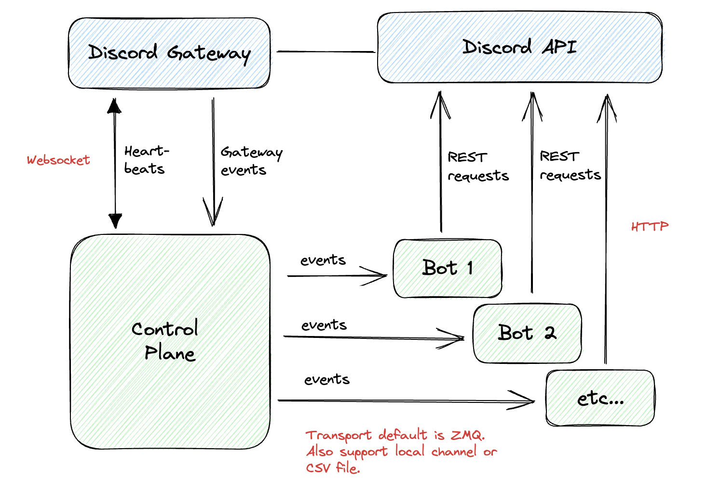

# User Guide

Discorder.jl provides an easy way to write Discord bots in Julia.

## Architecture

The primary difference between this and other Julia Discord libraries is that it has a separate control plane that primarily works with [Discord Gateway](https://discord.com/developers/docs/topics/gateway). This control plane continuously monitor activities from your Discord server and publish events.

Discord bots run as separate processes. You may operate multiple bots independently of each other. They all share the same events stream from the control plane.



## Quick start

Starting the control requires a simple config file. You can find examples configs in the [etc folder of this repo](etc).

```julia
using Discorder
serve(config_file_path="etc/dev.toml")
```

Bot clients can subscribe to the events and register for specific event patterns. For example, an "echo" bot can be written easily as such:

```julia
using Discorder

port = 6000
bot = Bot()

register_command_handler!(bot, CommandTrigger(r",echo (.*)")) do client, message, str
    create_message(client, message.channel_id;
        content="ok, you said: $str",
        message_reference=MessageReference(message_id=message.id)
    )
end

start(bot, port)
```

See `example` folder for more bot examples.
